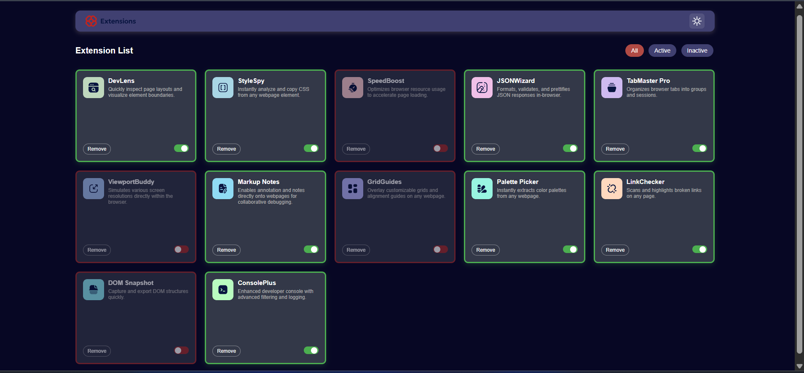
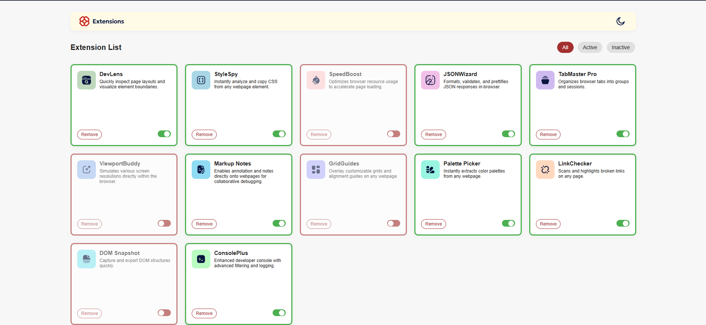
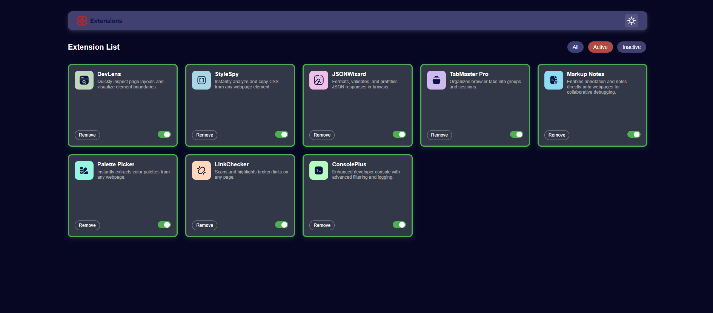

Browser extensions manager UI solution

This is a solution to the [Browser extensions manager UI challenge on Frontend Mentor](https://www.frontendmentor.io/challenges/browser-extension-manager-ui-yNZnOfsMAp). Frontend Mentor challenges help you improve your coding skills by building realistic projects. 

## Table of contents

- [Overview](#overview)
  - [The challenge](#the-challenge)
  - [Screenshot](#screenshot)
  - [Links](#links)
- [My process](#my-process)
  - [Built with](#built-with)
  - [What I learned](#what-i-learned)

## Overview

### The challenge

Users should be able to:

- Toggle extensions between active and inactive states
- Filter active and inactive extensions
- Remove extensions from the list
- Select their color theme
- View the optimal layout for the interface depending on their device's screen size
- See hover and focus states for all interactive elements on the page

### Screenshot

### Links

- Solution URL: [Add solution URL here](https://your-solution-url.com)
- Live Site URL: [Add live site URL here](https://your-live-site-url.com)

## My process

### Built with

- Semantic HTML5 markup
- CSS custom properties
- Flexbox
- CSS Grid
- Mobile-first workflow
- Javascript Functionality

### What I learned

<h3>Dynamic DOM Manipulation</h3>
    
Learned how to generate HTML elements (cards) dynamically from a JSON data source using JavaScript. 
   Used `document.createElement`, `classList`, and `innerHTML` to build and update the UI.

<h3>State Management</h3>
    
Managed a global array (`allExtensions`) to store and update the state of all extensions.
      Implemented a filter state (`currentFilter`) to control which cards are shown (All, Active, Inactive).

<h3>Event Handling</h3>
    
Attached event listeners to dynamically created elements for removing cards and toggling their active/inactive state.
     Used event delegation and `stopPropagation` to prevent unwanted event bubbling (e.g., clicking Remove doesn't toggle the switch).
    

<h3>Unique Identification</h3>
    
Assigned a unique `_uid` to each extension to reliably identify and update/remove the correct card, even after filtering or reordering.

<h3>Filtering and Rendering</h3>
    
Implemented filtering logic to show only active, inactive, or all extensions based on user selection.
     Ensured the UI updates correctly after any change (removal, toggle, or filter switch).

<h3>Accessibility and Usability</h3>
    
Used `tabindex` and `type="button"` to improve keyboard navigation and prevent accidental form submissions.
     Wrapped controls in separate containers to avoid event overlap and improve user experience.

<h3>Code Organization</h3>
    
Broke down logic into clear functions: rendering, event attachment, filtering, and theme management.
     Used comments and clear variable names for maintainability.

<h3>Debugging and Iteration</h3>
     
Learned to debug issues with event bubbling, index mismatches, and UI glitches by isolating problems and testing fixes.
     Improved reliability by using unique IDs and careful event handling.

Summary:
This project deepened my understanding of dynamic UI rendering, event handling, state management, and user experience best practices in vanilla JavaScript. I also learned how to debug tricky UI bugs and make my code more robust and maintainable.

